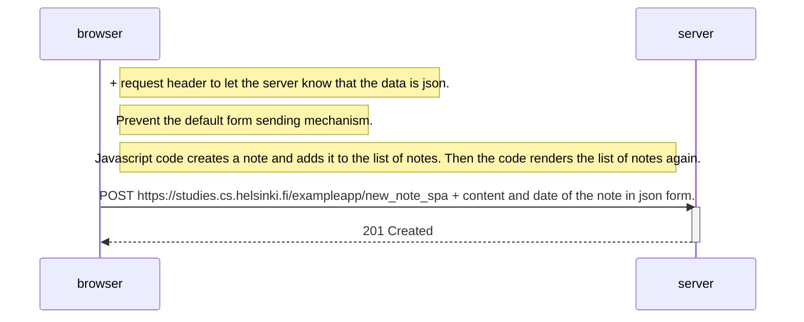

Kaavio tilanteesta, jossa käyttäjä luo uuden muistiinpanon single page ‑versiossa.

```mermaid
sequenceDiagram
    participant browser
    participant server

    Note right of browser: + request header to let the server know that the data is json.
    Note right of browser: Prevent the default form sending mechanism.
    Note right of browser: Javascript code creates a note and adds it to the list of notes. Then the code renders the list of notes again. 
    browser->>server: POST https://studies.cs.helsinki.fi/exampleapp/new_note_spa + content and date of the note in json form.
    activate server
    server-->>browser: 201 Created
    deactivate server


```
