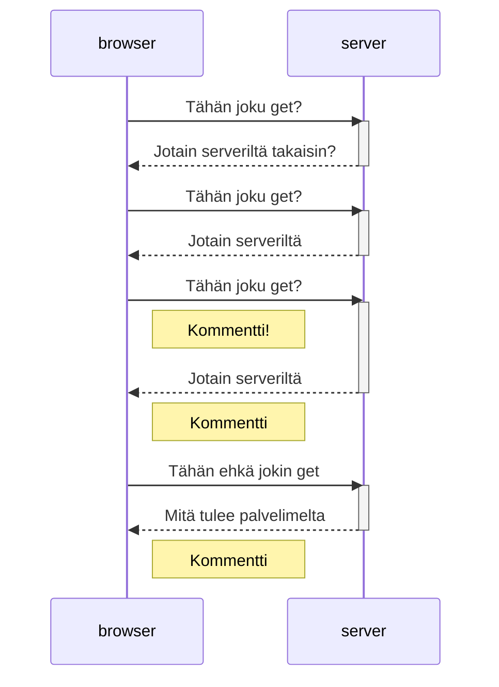

Kaavio siitä, mitä tapahtuu, kun käyttäjä luo uuden muistiinpanon ollessaan sivulla https://studies.cs.helsinki.fi/exampleapp/notes eli kirjoittaa tekstikenttään jotain ja painaa nappia tallenna.

```mermaid
sequenceDiagram
    participant browser
    participant server
    
    browser->>server: Tähän joku get?
    activate server
    server-->>browser: Jotain serveriltä takaisin?
    deactivate server
    
    browser->>server: Tähän joku get?
    activate server
    server-->>browser: Jotain serveriltä
    deactivate server
    
    browser->>server: Tähän joku get?
    activate server

    Note right of browser: Kommentti!

    server-->>browser: Jotain serveriltä
    deactivate server
    
    Note right of browser: Kommentti
    
    browser->>server: Tähän ehkä jokin get
    activate server
    server-->>browser: Mitä tulee palvelimelta
    deactivate server    

    Note right of browser: Kommentti
```
